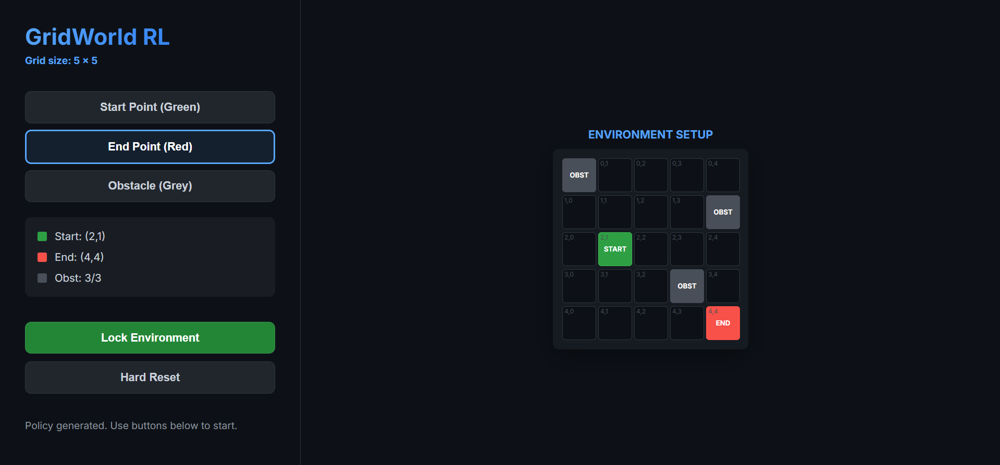
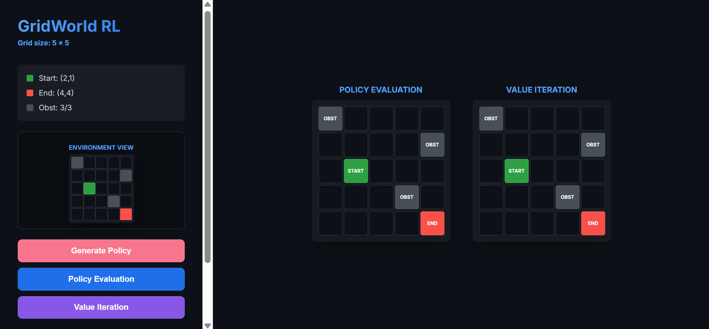
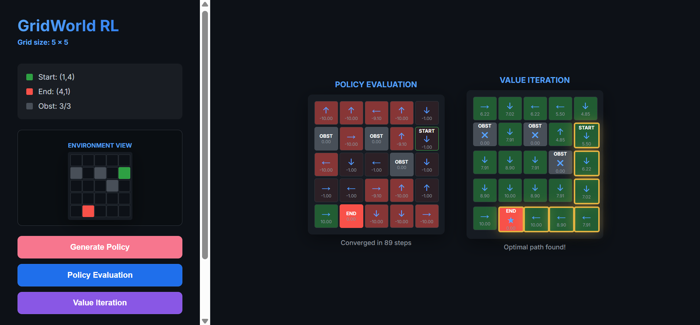

# GridWorld Reinforcement Learning Interactive System (DRL_hw1)

這是一個為深度強化式學習課程開發的互動式網格世界 (GridWorld) 模擬系統。本系統專注於視覺化展現 **策略評估 (Policy Evaluation)** 與 **價值迭代 (Value Iteration)** 之間的差異，並提供一個直觀的環境設定介面。

## 🌐 線上預覽 (Live Demo)

您可以直接訪問以下網址來操作本系統：
👉 **[https://drl-hw1-1pjn.onrender.com/](https://drl-hw1-1pjn.onrender.com/)**

## 🌟 核心功能

1.  **動態環境生成**：支援 5x5 到 9x9 的網格維度設定。
2.  **互動式環境配置**：
    *   **起始點 (Green)**：點擊標記學習的起點。
    *   **終點 (Red)**：目標點狀態，進入該狀態會獲得最大獎勵 (+10)。
    *   **障礙物 (Grey)**：限制為 $n-2$ 個區域。
3.  **對照式計算視覺化**：
    *   **Policy Evaluation (策略評估)**：針對當前策略完成收斂計算，即時反應價值矩陣 (Value Matrix)。
    *   **Value Iteration (價值迭代)**：動態演示價值收斂過程，最終標示找出最優「黃金路徑」。
4.  **智慧型 UI 切換**：
    *   **收納功能 (Mini-Map)**：鎖定環境後，大配置圖會自動縮小存入側邊欄，釋放桌面空間顯示兩組實驗結果。

## 📸 介面演示 (Demo Photos)

### Phase 1：網格維度與環境配置

*圖 1：使用者首先設定網格維度與放置起終點/障礙物。*

### Phase 2：鎖定環境與收納

*圖 2：點擊 Lock 後，環境會縮小存入側邊欄作為對照參考。*

### Phase 3：演算法計算結果比對

*圖 3：同時展示 Policy Evaluation (PE) 與 Value Iteration (VI) 的計算對照。*

## 📖 使用說明 (Manual)

### 第一步：初始化
- 在側邊欄輸入 **Dimension (5-9)**。
- 點擊 **Generate Grid** 開始配置。

### 第二步：配置環境 (Interactive Setup)
- 切換 **Start/End/Obstacle** 模式。
- 直接在網格中點擊完成標記（再次點擊取消）。
- 確認後點擊側邊欄底部的 **Lock Environment**。

### 第三步：策略生成與評估
- 點擊 **Generate Policy** 生成單向箭頭。
- 點擊 **Policy Evaluation**：系統將依據目前箭頭計算該策略下的長期回報。

### 第四步：價值迭代與最優路徑
- 點擊 **Value Iteration**：右側網格將開始動畫閃動計算。
- 收斂後將自動標示出 **金色最佳路徑** 與最佳動作矩陣。

## 🚀 數學參數

- **Reward**：終點 `+10` / 邊界與障礙物 `-1` / 普通步數 `-0.1`
- **參數**：折扣因子 ($\gamma$) = `0.9` / 收斂門檻 ($\theta$) = `1e-4`

---
**開發者**：7114056010 洪翌榛
**指導老師**：陳煥
